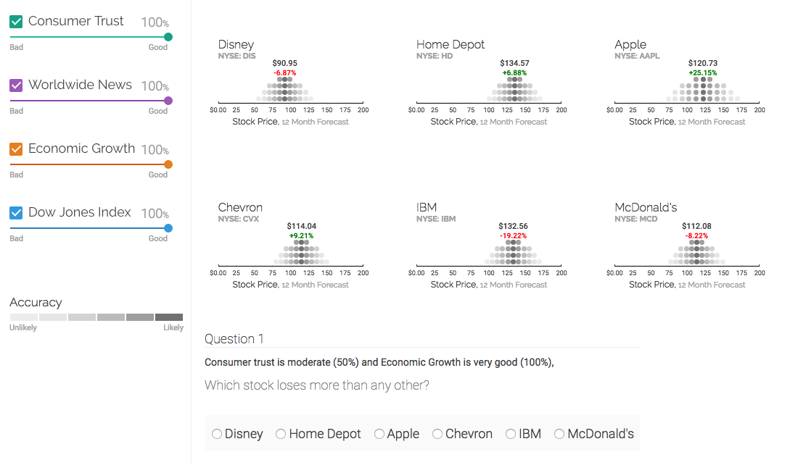

# Stock Prices Visualisation

All probability is conditional.
Truths are known because of the conditions assumed given the evidence in observations.

Useful commands (example):

´´´
mongoexport --db meteor --collection series --out series.json --host=127.0.0.1:3001
mongoexport --db meteor --collection stocks --out stocks.json --host=127.0.0.1:3001

mongoimport -h ds017256.mlab.com:17256 -d uncertainty -c stocks -u admin -p 12345 --file stocks.json
mongoimport -h ds017256.mlab.com:17256 -d uncertainty -c series -u admin -p 12345 --file series.json

´´´
